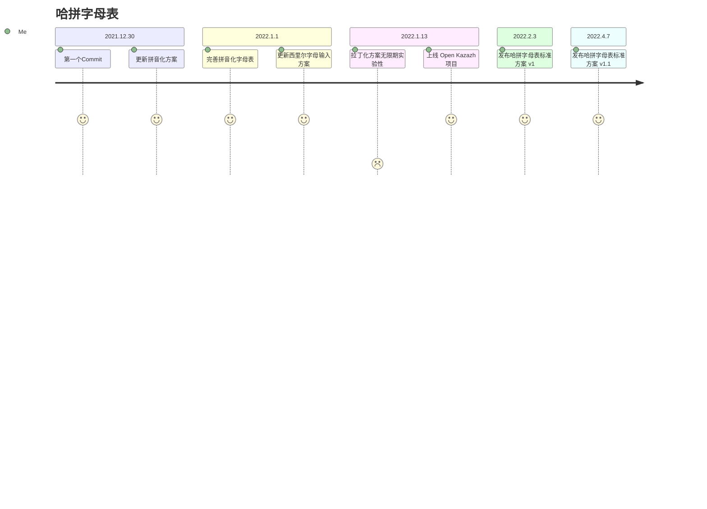
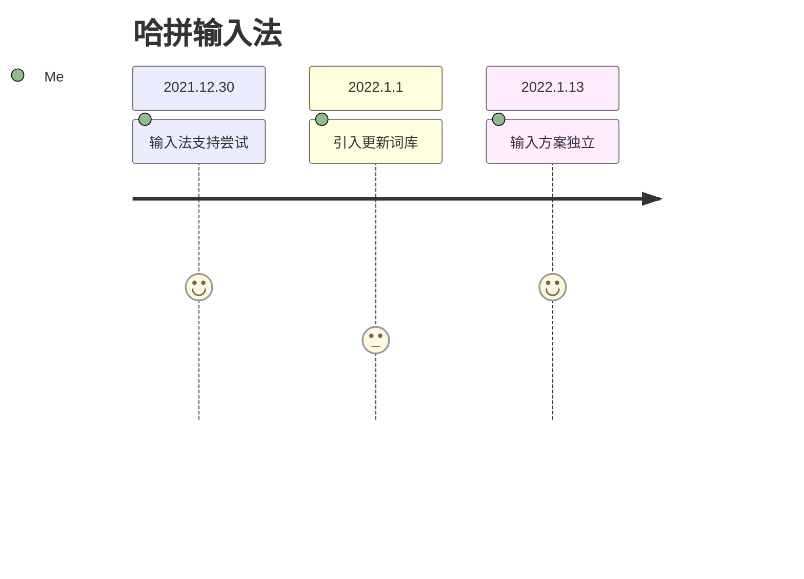
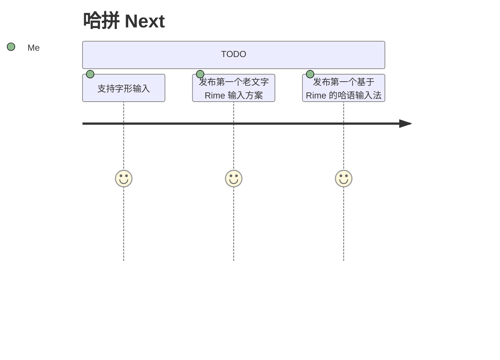

# 里程碑

```mermaid
journey
    title 哈拼字母表
    section 2021.12.30
      第一个Commit: 5: Me
      更新拼音化方案: 5: Me
    section 2022.1.1
      完善拼音化字母表: 5: Me
      更新西里尔字母输入方案: 5: Me
    section 2022.1.13
      拉丁化方案无限期实验性: 1: Me
      上线 Open Kazazh 项目: 5 : Me
    section 2022.2.3
      发布哈拼字母表标准方案 v1: 5 : Me
    section 2022.4.7
      发布哈拼字母表标准方案 v1.1: 5 :Me
```

```mermaid
journey
    title 哈拼输入法
    section 2021.12.30
      输入法支持尝试: 5: Me
    section 2022.1.1
      引入更新词库: 3: Me
    section 2022.1.13
      输入方案独立: 5: Me
```

```mermaid
journey
    title 哈拼 Next
    section TODO
      支持字形输入: 5: Me
      发布第一个老文字 Rime 输入方案: 5: Me
      发布第一个基于 Rime 的哈语输入法: 5: Me
```
