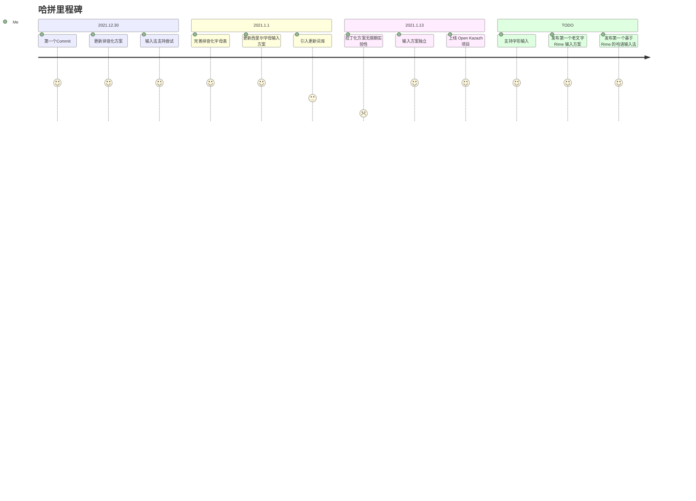

# 里程碑

<!-- - 2022.1.1
  - [引入更新词库](https://github.com/HerbertHe/rime-kz-experiment/commit/2ace6754e689b79561aa1186b67137532340864c)
  - [更新西里尔字母输入方案](https://github.com/HerbertHe/rime-kz-experiment/commit/9b9e6f682093c44ba2cc742f24b71672d917d910)
  - [完善拼音化字母表](https://github.com/HerbertHe/rime-kz-experiment/commit/d37533fe5902ff7292a308ac712774bee0eb3d90)
- 2021.12.30
  - [输入法支持尝试](https://github.com/HerbertHe/rime-kz-experiment/commit/305459eb845a2d0e083167ac6ff9ea6fe68a613d)
  - [更新拼音化方案](https://github.com/HerbertHe/rime-kz-experiment/commit/bb5dad9388aa0b6bc3078a51a998d03463147e0a)
  - [First Commit](https://github.com/HerbertHe/rime-kz-experiment/commit/7ed18f48458a2cf55395bf85372c3f82823e4994) -->
